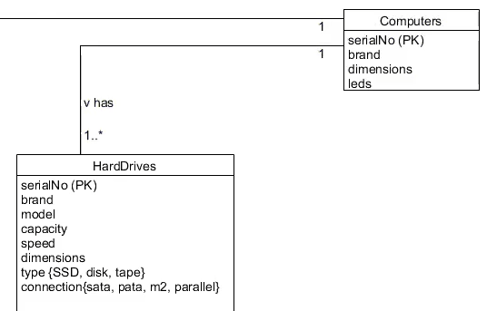

### One "computers" has one "power supplies", so it a 1 to 1 match, meaning one has one. 

### One "computers" has one or many "Hard Drives", so it a 1 to many. 

### One or many "graphics Card" belongs to one "computers", so many to 1, this is class its listed as belongs to, but you can write it as "has" like the ones above. 

### One or many "CPUs" belongs to one "computers", so many to 1, this is class its listed as belongs to, but you can write it as "has" like the ones above. 

### One "computer cases" belongs to one "computers", so 1 to 1, this is class its listed as belongs to, but you can write it as "has" like the ones above. 

### One or many "main boards (mother boards)" has to one or many "port types", so One or many to One or many, this is class its listed as belongs to, but you can write it as "has" like the ones above. 

### "Main board ports" is an Association class and it must have serialNo and PortType has primary keys, and each iterations must have a mac address linked up by the pk of "main boards" and "port types"

### Or you could do it this way, he says its a better way of doing it

### NOT DONE