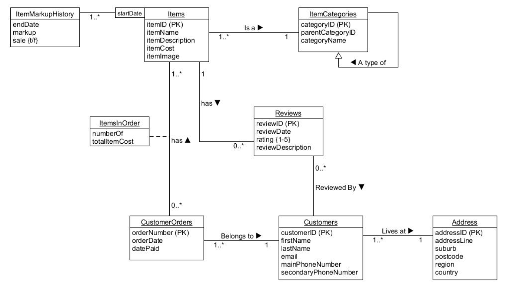

### ItemMarkupHistory
Attributes: itemID (PK), startDate, endDate, markup (%)
Relationships: One-to-many with Items (each item can have multiple markup histories).
### Items
Attributes: itemID (PK), itemName, itemDescription, itemCost, itemImage
Relationships:
One-to-one with ItemCategories (each item belongs to one category).
One-to-many with ItemsInOrder (an item can be on multiple orders).
### ItemCategories
Attributes: categoryID (PK), parentCategoryID, categoryName
Relationships: Hierarchical structure for categories (categories can have subcategories).
### Reviews
Attributes: reviewID (PK), reviewDate, rating (1-5), reviewDescription
Relationships: Optional many-to-zero-or-one with Customers (not all reviews need to be linked to customers).
### Customers
Attributes: customerID (PK), firstName, lastName, email, mainPhoneNumber, secondaryPhoneNumber
Relationships:
Zero-or-one-to-many with Orders (not all customers need to have orders).
Zero-or-one-to-many with Addresses (customers may or may not have addresses listed).
Optional many-to-zero-or-one with Reviews.
### Orders
Attributes: orderNumber (PK), orderDate, totalItemCost, datePaid
Relationships: Belongs exclusively to one customer.
### Addresses
Attributes: addressID (PK), addressLine1, addressLine2, suburb, postcode, region, country
Relationships: Indicates where customers live.
This diagram represents the structure and relationships of an e-commerce or retail business database system. If you have any specific questions or need further details, feel free to ask!

## Why does ItemCategories have an arrow pointing from itself?

The arrow pointing from ItemCategories to itself indicates a recursive relationship. 
This is used when an entity has a relationship with itself.
In this case, it’s used to represent a hierarchical structure of categories, where a category can have a parent category (also an ItemCategory).
This is common in categories/subcategories structures.


## 	Why does the association line between Customers and Reviews only have one set of multiplicity?

The association line between Customers and Reviews only has one set of multiplicity because it’s an optional relationship. This means that a customer can have zero or more reviews (0…*), but a review doesn’t necessarily have to be associated with a customer (hence no multiplicity on the Reviews side). This could be the case if the system allows anonymous reviews.


## How many Addresses can any one person live at? Can you think of another way to design this?

In this design, a Customer can have zero or one Address (0…1). This means that each customer can live at one address at most according to this schema. However, this might not be sufficient for all use cases. For example, a customer might have both a billing address and a shipping address. To accommodate this, we could introduce another entity, say CustomerAddresses, with a many-to-many relationship between Customers and Addresses. This would allow a customer to have multiple addresses and an address to be associated with multiple customers.


## What is the Primary Key of ItemMarkupHistory and ItemsInOrder?

The primary key of ItemMarkupHistory is itemID (PK), and for ItemsInOrder, it’s numberOf. A primary key is a unique identifier for each record in a database table. It must contain unique values and cannot be null.


```sql 
CREATE TABLE Addresses (
    addressID INT IDENTITY PRIMARY KEY,
    addressLine VARCHAR(100) NOT NULL,
    suburb VARCHAR(50) NOT NULL,
    postcode VARCHAR(10) NOT NULL,
    region VARCHAR(50) NOT NULL,
    country VARCHAR(50) NOT NULL
);

CREATE TABLE Customers (
    customerID INT IDENTITY PRIMARY KEY,
    firstName VARCHAR(100) NOT NULL,
    lastName VARCHAR(100) NOT NULL,
    email VARCHAR(100) NOT NULL,
    mainPhoneNumber VARCHAR(15) NOT NULL,
    secondaryPhoneNumber VARCHAR(15),
    addressID INT FOREIGN KEY REFERENCES Addresses(addressID)
);

CREATE TABLE ItemCategories (
    categoryID INT IDENTITY PRIMARY KEY,
    parentCategoryID INT FOREIGN KEY REFERENCES ItemCategories(categoryID),
    categoryName VARCHAR(100) NOT NULL
);

CREATE TABLE Items (
    itemID INT IDENTITY PRIMARY KEY,
    itemName VARCHAR(150) NOT NULL,
    itemDescription VARCHAR(MAX) NOT NULL,
    itemCost DECIMAL(10,2) NOT NULL,
    itemImage VARCHAR(MAX) NOT NULL,
    categoryID INT NOT NULL FOREIGN KEY REFERENCES ItemCategories(categoryID)
);

CREATE TABLE CustomerOrders (
    orderNumber INT IDENTITY PRIMARY KEY,
    customerID INT NOT NULL FOREIGN KEY REFERENCES Customers(customerID),
    orderDate DATE NOT NULL DEFAULT GETDATE(),
    datePaid DATE
);

CREATE TABLE ItemsInOrder (
    orderNumber INT NOT NULL FOREIGN KEY REFERENCES CustomerOrders(orderNumber),
    itemID INT NOT NULL FOREIGN KEY REFERENCES Items(itemID),
    numberOf INT NOT NULL DEFAULT 1,
    totalItemCost DECIMAL(10,2),
    PRIMARY KEY (orderNumber, itemID)
);

CREATE TABLE Reviews (
    reviewID INT IDENTITY PRIMARY KEY,
    customerID INT NOT NULL,
    itemID INT NOT NULL,
    reviewDate DATE NOT NULL DEFAULT GETDATE(),
    rating INT NOT NULL CHECK (rating >= 1 AND rating <= 5),
    reviewDescription VARCHAR(MAX) NOT NULL,
    CONSTRAINT CK1 UNIQUE (customerID, itemID, reviewDate),
    FOREIGN KEY (customerID) REFERENCES Customers(customerID),
    FOREIGN KEY (itemID) REFERENCES Items(itemID)
);

CREATE TABLE ItemMarkupHistory (
    itemID INT NOT NULL FOREIGN KEY REFERENCES Items(itemID),
    startDate DATE NOT NULL,
    endDate DATE,
    markup DECIMAL(4,1) DEFAULT 1.3 NOT NULL,
    sale BIT DEFAULT 0,
    PRIMARY KEY (itemID, startDate)
);

```


