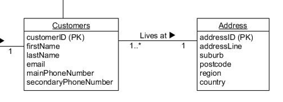
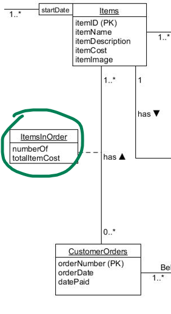
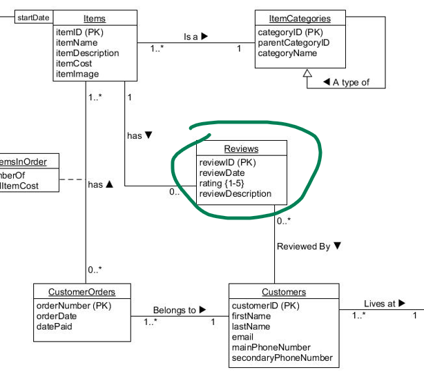
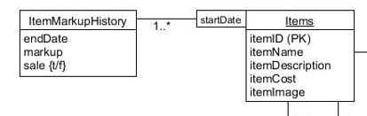
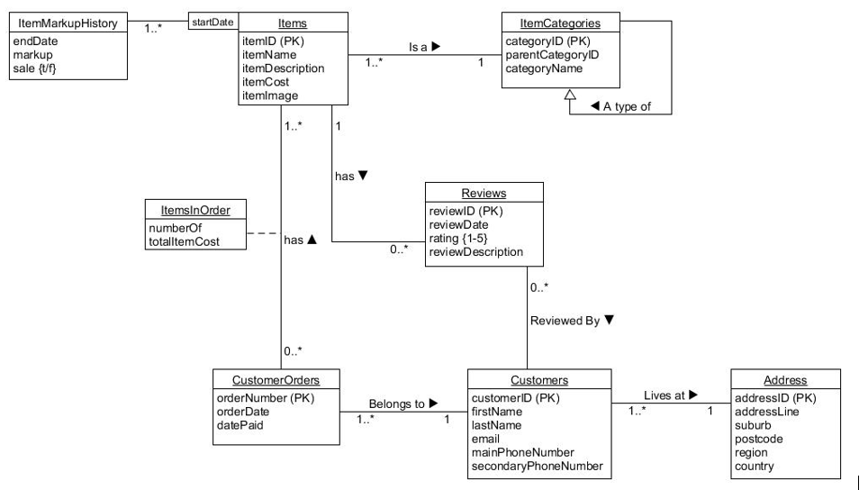

^ Columns: customerID (PK), firstName, lastName, email, mainPhoneNumber, secondaryPhoneNumber

Foreign Key (FK): addressID -> Address(addressID)

In your Customers table schema, you have defined addressID as a foreign key (FK) that references Address(addressID). This is correct and here’s why:

A foreign key is a column or a set of columns in one table that is used to “point” to the primary key in another table. They are used to establish a link between the data in two tables. The table containing the foreign key is called the child table, and the table containing the primary key is called the referenced or parent table.

In your case, addressID in the Customers table is a foreign key that points to addressID in the Address table. This means that for each record in the Customers table, the value of addressID must match a value in the addressID column of the Address table. This ensures referential integrity, meaning you can’t have a customer with an addressID that doesn’t exist in the Address table.

So, your foreign key FK(addressID) -> Address(addressID) is correct because it correctly establishes this relationship between the Customers and Address tables.




^ this schema for the ItemsInOrder table is much better and aligns well with typical database design practices. Here’s the breakdown:

ItemsInOrder:
Columns: numberOf, totalItemsCost
Primary Key (PK): orderNumber, itemID
Foreign Keys (FK): orderNumber -> CustomerOrders(orderNumber), itemID -> Items(itemID)
This schema correctly includes orderNumber and itemID as the composite primary key, numberOf and totalItemsCost as additional attributes, and establishes foreign key relationships with the CustomerOrders and Items tables.





```SQL
CREATE TABLE Reviews (
    reviewID INT IDENTITY PRIMARY KEY,
    customerID INT NOT NULL FOREIGN KEY REFERENCES Customers(customerID),
    itemID INT NOT NULL FOREIGN KEY REFERENCES Items(itemID),
    reviewDate DATE NOT NULL,
    rating INT NOT NULL,
    reviewDescription VARCHAR(MAX) NOT NULL
);


```

Columns: reviewID (PK), customerID, itemID, reviewDate, rating, reviewDescription

Primary Key (PK): reviewID
Foreign Keys (FK): customerID -> Customers(customerID), itemID -> Items(itemID)

In a database, a foreign key (FK) is a column or a set of columns that is used to establish a link between the data in two tables. The concept of referential integrity is at the heart of using foreign keys. This means that the foreign key in one table refers to the primary key in another table.

In your case, itemID in the ItemMarkupHistory table is a foreign key that points to itemID in the Items table. This means that for each record in the ItemMarkupHistory table, the value of itemID must match a value in the itemID column of the Items table.

This relationship allows you to join the ItemMarkupHistory table with the Items table on the itemID column, which can be useful when you want to query data from both tables at the same time.

So, the statement FK(itemID) -> Items(itemID) means that for each record in ItemMarkupHistory, the itemID must either be NULL or match a itemID in the Items table.




```sql
CREATE TABLE ItemMarkupHistory (
    itemID INT NOT NULL FOREIGN KEY REFERENCES Items(itemID),
    startDate DATE NOT NULL,
    endDate DATE,
    markup DECIMAL(4,1) DEFAULT 1.3 NOT NULL,
    sale BIT DEFAULT 0,
    PRIMARY KEY (itemID, startDate)
);

```

ItemMarkupHistory:

Columns: itemID (PK), startDate (PK), endDate, markup, sale

Primary Key (PK): itemID, startDate
Foreign Key (FK): itemID -> Items(itemID)


## All



Table Schemas (check spelling):

Next we need to be sure which tables end up with foreign keys and which relationships result in new association tables.  The best way to do this is to write out the table schemas for the various associations.  Using the UML database design provided and the below example table schemas showing the table name and attributes, complete the table schemas for the missing tables:
Using the following notation:

TableName(attribute1, attribute2, … attribute n)
PK(attribute1)
FK(attribute2) -> TableName2(attribute)
Example 1.	ItemCategories table schema:
ItemCategories(categoryID, parentCategoryID, categoryName)
PK(categoryID)
FK(parentCategoryID) -> ItemCategories(categoryID)

Example 2.	Items table schema:
Items(itemID, itemName, itemDescription, itemCost, itemImage, categoryID)
PK(ItemID)
FK(categoryID) -> Categories(categoryID)

Example 3.	Addresses table schema:
Addresses(addressID, addressLine, suburb, postcode, region, country)
PK(addressID)

Question 1.	Customers Table Schema?
Customers(firstName, lastName, email, mainPhoneNumber, secondaryPhoneNumber)
PK(customerID)
FK(addressID) -> Address(addressID)

Question 2.	CustomerOrders Table Schema?
CustomerOrders(datePaid, orderDate)
PK(orderNumber)
FK(customerID) -> customers(customerID)

Question 3.	ItemsInOrder Table Schema?
ItemsInOrder(numberOf, totalItemsCost)
PK(orderNumber, itemsID )
FK(orderNumber) -> customerOrders (orderNumber)
FK(itemID) -> items(itemsID)

Question 4.	Reviews Table Schema?
Reviews(reviewDate, rating, reviewDescription)
PK(reviewID)
FK(customerID) -> customers(customerID)
FK(itemID) -> items(itemID)

Question 5.	ItemMarkupHistory Table Schema?
ItemMarkupHistory(endDate, markup, sale)
PK(startDate,itemsID)
FK(itemID) -> items (itemID)

